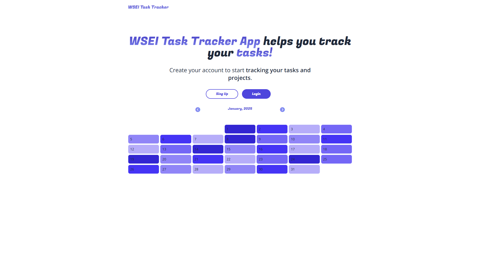

# WSEI Task Tracker 🚀

**WSEI Task Tracker** is an app designed to help you stay on top of your daily tasks, focusing on tasks for today while still allowing you to view past and future tasks. You can easily add tasks, select their status, add descriptions, and delete tasks as needed.

Once a task is marked as **done**, it will disappear from your daily view but you can toggle its visibility to review what you've accomplished. Completed tasks will be highlighted accordingly.

The app offers **email/password** login and optionally allows you to add your name during registration for a personalized greeting. The calendar dynamically adjusts based on the number of tasks planned for each day — the more tasks, the darker the calendar tile. If there are no tasks, the tile will remain white. This approach helps you focus on current tasks without overwhelming details, grounded in psychological principles of minimizing distractions.

---

### Features ✨

- **Task management:** Add, delete, and update tasks.
- **Task status:** Easily mark tasks as done, and hide or reveal them later.
- **Personalized experience:** Add your name at registration for a custom greeting.
- **Dynamic calendar view:** Darker calendar tiles for busier days, with white tiles for empty days.
- **Psychological design:** Simplified calendar and task view to minimize distractions and boost focus.

---

### Getting Started 🏁

To get started, first, clone the repository and set up the project:

1. Clone the repo:

   ```bash
   git clone https://github.com/yourusername/wsei-task-tracker.git
   ```

2. Install dependencies:

   ```bash
   npm install
   # or
   yarn install
   # or
   pnpm install
   # or
   bun install
   ```

3. Run the development server:

   ```bash
   npm run dev
   # or
   yarn dev
   # or
   pnpm dev
   # or
   bun dev
   ```

4. Open [http://localhost:3000](http://localhost:3000) in your browser to view the app!

You can also access the app at [https://wsei-task-tracker.vercel.app/](https://wsei-task-tracker.vercel.app/).

---

### Layout 🖼️



---

### User Dashboard 🖼️


---

### Technologies Used 🔧

- **Next.js** - The React framework for production
- **Next/font** - Automatically optimizes and loads the Geist font family by Vercel

---

### Editing the Page ✍️

You can start editing the page by modifying `app/page.js`. The page will auto-update as you make changes.
